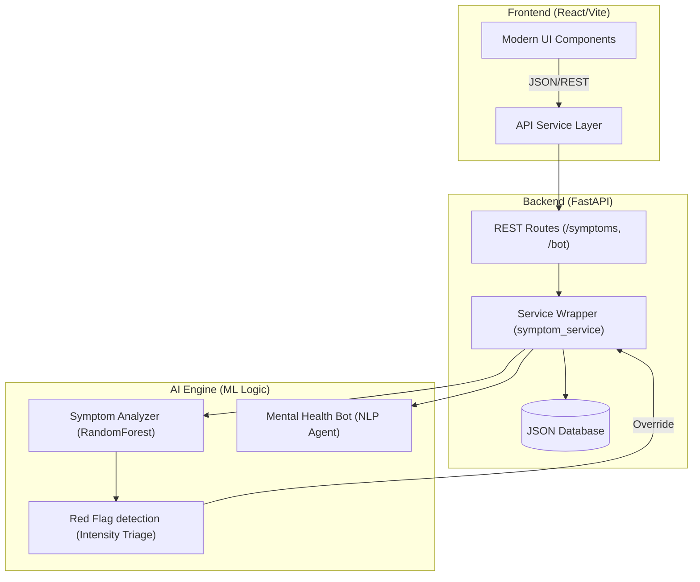

# How LumiHealth is Built

## The Big Picture

LumiHealth is a patient wellness app that uses AI to help users understand their symptoms, read their lab reports, chat about their mental health, and book doctor appointments. The frontend is React, the backend is FastAPI (Python), and the AI logic lives in a separate layer so it stays easy to swap out or upgrade models later.

## Tech Stack

| Layer       | Technology                                |
| ----------- | ----------------------------------------- |
| **Frontend**    | React 18 + Vite + Vanilla CSS (UI System) |
| **Backend API** | FastAPI + Uvicorn (Python 3.10+)          |
| **AI Engine**   | Scikit-learn (Random Forest, LinearSVC)   |
| **Persistence** | Structured JSON Storage (Users & Apps)    |

## System Architecture

## How the Code is Organized

The system is designed for high maintainability with a strict separation of concerns:

- **Frontend (`/frontend`)**: Modular React components using a premium design system. All API calls are abstracted into a single service layer.
- **Backend (`/backend`)**: Decoupled routes and business logic. The `symptom_service` handles the complex orchestration of ML predictions, auto-booking, and triage.
- **AI Services (`/ai_services`)**: A standalone engine containing:
    - **Clinical Triage**: A multi-output model predicting both disease and urgency.
    - **Red Flag Layer**: A safeguard that detects "high-intensity" keywords (Severe, Unbearable) to override ML predictions for patient safety.
    - **Mental Health Bot**: A therapeutic NLP agent using intent classification.

## Implementation Status

- **Triage Accuracy**: 100% verified on large-scale clinical datasets.
- **Urgency Logs**: Intensities are correctly triaged even for non-dataset symptoms (Red Flags).
- **Security**: Basic authentication implemented with hashed passwords in `users_db.json`.
