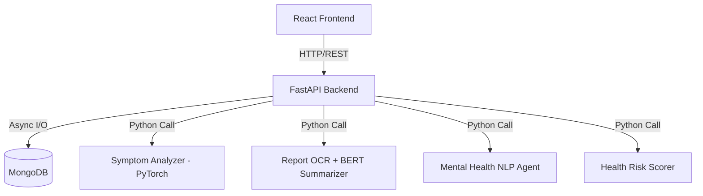

# How LumiHealth is Built

## The Big Picture

LumiHealth is a patient wellness app that uses AI to help users understand their symptoms, read their lab reports, chat about their mental health, and book doctor appointments. The frontend is React, the backend is FastAPI (Python), and the AI logic lives in a separate layer so it stays easy to swap out or upgrade models later.

## Tech Stack

| Layer       | What we're using                          |
| ----------- | ----------------------------------------- |
| Frontend    | React 18 + Vite + Tailwind CSS v4         |
| Backend API | FastAPI + Uvicorn (Python 3.10+)          |
| AI/ML       | PyTorch models + HuggingFace Transformers |
| Database    | MongoDB (using the `motor` async driver)  |

## How it all connects

## How the Code is Organized

The backend is split into three clean layers so things don't get messy:

- **Routes** – just handles incoming HTTP requests, validates the data with Pydantic, and passes it along
- **Services** – where the actual business logic lives; routes call these functions
- **AI Services** – completely separate ML scripts that just expose simple functions like `predict()` or `summarize()`. This way the data science team can swap in a better model without touching the API code at all.

## Things to Know for Production

Right now this is still a dev build. A few things that need to happen before going live:

- **Blocking AI calls** – heavy stuff like OCR and LLM inference blocks the thread. We're using `asyncio.to_thread` to push those off the main event loop so normal requests don't get held up.
- **Security** – there's no real auth yet. Before launch, we need JWT tokens and rate limiting to protect the sensitive health data users are sharing.
